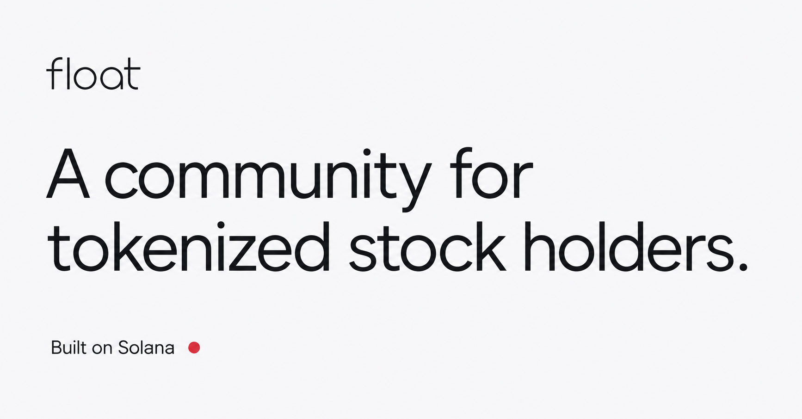

# Float

A community and market dashboard for people who hold tokenized stocks on Solana.

**[Live product](https://joinfloat.xyz)** · **[Explore markets](https://joinfloat.xyz/markets)** · **[Submission package](docs/hackathon/README.md)**



Float connects wallet ownership to community participation. A holder signs a message; the server checks supported Solana token balances. Members can discuss markets under a nickname, see their portfolio, follow relevant news and events, and optionally display a holder tier. Discussions and Markets can be explored without a wallet.

## Try it in 60 seconds

1. Open **Explore markets**. Search for a company, filter by issuer or asset type, and expand a row for sources and market details. No wallet is required.
2. To post, reply or vote, choose **Join the community** with a supported token in a Solana wallet. Phantom, Backpack and Solflare integrations are implemented. Sign the membership message; no transaction or transfer is requested.
3. Visit **Discussions**, select a channel and open a post. Replies live in the detail view. Use the three-dot menu to manage your own post or report/block another author.
4. In **Profile**, set a nickname and bio and choose whether to show your tier. Badges start at $100 of reliably valued supported holdings; a verified holder can participate with or without a badge.
5. On iPhone, install from Safari. After signing in the wallet, reopen Float from the Home Screen to complete the session transfer. Browsers cannot reliably force iOS to reopen an installed web app.

Discussions and replies are public; writing and voting require verified holdings. There is no demo bypass or shared funded wallet. Reviewers without an eligible token can read Discussions and explore Markets. Do not buy a token solely to review the product.

## What is implemented

- **Home:** private portfolio, relevant news and upcoming events when available.
- **Discussions:** channels including Crypto and Off Topic, posts, replies, polls, saved posts, My posts, author bios, deletion, reporting and user blocking.
- **Markets:** multi-issuer Solana tokenized-stock coverage with price, valuation basis, DEX volume, liquidity and source/freshness explanations. Coverage is partial and some quotes can be delayed.
- **Profile:** nickname, bio, appearance, notifications and optional Bronze / Silver / Gold / Platinum / Diamond badge.
- **Installed app:** PWA manifest/icons, installation guidance and server-mediated wallet sign-in handoff.

## Why Solana

Solana supplies the ownership evidence: wallet signatures and public SPL / Token-2022 token accounts identified by exact mint address. Float verifies the signature and finalized holdings on the server. A ticker alone never establishes eligibility. This allows supported holdings to be checked across compatible wallets without asking for brokerage credentials.

Float deploys no custom onchain program. Posts, profiles, sessions and moderation are stored offchain in Cloudflare D1. It does not trade, custody assets, issue investment tokens, or send a transaction for sign-in. A verified wallet is not proof of a unique person, expertise, continuous ownership or registered shareholder status.

## Architecture

| Layer | Implementation |
| --- | --- |
| UI | React 19, TypeScript, Vinext with Next.js-style routes, Tailwind CSS, Base UI |
| Runtime | Cloudflare Workers; dedicated public hackathon deployment |
| Storage | Cloudflare D1 / SQLite; Drizzle migrations |
| Wallet proof | Ed25519 signature verification, one-use challenges, finalized RPC balance/mint checks |
| Session | Server-owned membership, 24-hour HttpOnly cookie; wallet-to-PWA handoff |
| Registry | Reviewed issuer seeds plus verified, demand-driven Backpack discovery |
| Public data | Provider adapters and shared source caches with timestamps and failure states |

Read [engineering decisions](docs/engineering-repair-2026-09-13.md), [Cloudflare deployment](docs/cloudflare-hackathon-deployment.md), and the current [release evidence](docs/hackathon/release-checklist.md). Older release documents describe the state at their date.

## Membership, tiers and privacy

A positive balance of a supported token qualifies for membership. Membership expires after 24 hours; holdings refresh while active and sensitive actions enforce server-side rules. This is not a continuous real-time ownership guarantee.

No value badge is shown below $100 of supported verified holdings value. Bronze starts at $100, Silver at $1,000, Gold at $10,000, Platinum at $100,000 and Diamond at $1,000,000. Missing or ambiguous valuation also means no value badge; it does not establish that a wallet holds less than $100. Verified supported holdings grant posting, replying and voting rights independently of badges. Public badges are optional and never show an exact balance.

The service processes wallet addresses and balances to verify membership and provide the private portfolio. Public readers see the chosen alias, profile photo, bio, contributions and optional badge, not the private wallet/portfolio view. Do not describe this as zero-knowledge or as the server never seeing an address. Read the live [Privacy page](https://joinfloat.xyz/trust) for storage and retention details.

## Registry and data limits

The base registry review date is September 13, 2026. Backpack additions are checked on demand every five minutes, verified against issuer metadata and finalized mint data, then retained in D1. An idle site catches up on the next request. Other issuers use reviewed seed lists; they are not all automatically rediscovered.

See [September 21 registry reconciliation](docs/hackathon/registry-review.json) for the live Backpack comparison. This comparison does not re-audit every issuer or every token's legal rights. `pnpm audit:tokens` intentionally checks seed drift only; a seed drift warning is not proof that the runtime registry missed a listing.

Market values are not guaranteed executable prices or complete market coverage. News/events depend on upstream availability; missing events do not prove that no event exists. The public Cloudflare deployment has no R2 avatar storage binding, so avatar upload is unavailable there.

## Run locally

Requires Node 22.13+ and pnpm. Preserve the lockfile.

```sh
pnpm install --frozen-lockfile
cp .env.example .env
# Create an ignored .dev.vars with local Worker settings.
# Local Sites admin identity only: ADMIN_EMAILS=seedy@sites.test
pnpm db:local
pnpm dev
```

Use the URL printed by the dev server. `SOLANA_RPC_URL` must be an authenticated mainnet RPC endpoint for reliable live wallet verification; keep it server-side. The public RPC fallback can reject hosted traffic. Never commit `.env`, `.dev.vars`, RPC API keys or wallet secrets. Restart after changing local Worker settings. No paid data key is required for the core flow; provider coverage can be limited.

The Sites deployment and the separate Cloudflare hackathon deployment have different databases and sessions. `/admin` uses the configured trusted admin identity; a local test email is never a production admin.

## Verify and deploy

```sh
pnpm build           # strict types, full lint, all tests/*.test.mjs, production build
pnpm audit --prod --audit-level=high
pnpm prepare:cloudflare
# Deploy dist/server/wrangler.float.json using your authorized Cloudflare account.
```

`node scripts/check-repair-runtime.mjs` runs isolated Worker/D1 scenarios with synthetic users and simulated providers. It does not prove real-device wallet behavior or production capacity. Additional legacy integration commands are documented in [the historical README](docs/hackathon/legacy-readme.md). Do not point test fixtures at production.

See [device test matrix](docs/hackathon/device-qa.md): Phantom and Backpack Home Screen return success was reported by the founder. Solflare real-device completion is still pending; provider simulations are not a substitute.

## Development history and AI assistance

This repository includes work begun before September 14, 2026 under the earlier HolderPulse name, including survey/research tools. The directory and some internal identifiers retain that name. Those modules remain for history and are not the submitted core experience. See [development disclosure](docs/hackathon/development-history.md) for the dated boundary and subsequent work.

RJ directed product decisions, tested the app and used ChatGPT/Codex to assist implementation, debugging, design iteration and documentation. This is an AI-assisted solo-founder project; role names used during design reviews are not additional human teammates.

## Current limits

Early working product: no independently audited security claim, institutional-scale benchmark, paid subscription flow or demonstrated external-user traction is asserted. Real-device Solflare QA, independently recruited user validation and final video recording remain founder tasks. The current release checklist distinguishes automated checks, rendered QA and reported device results.
